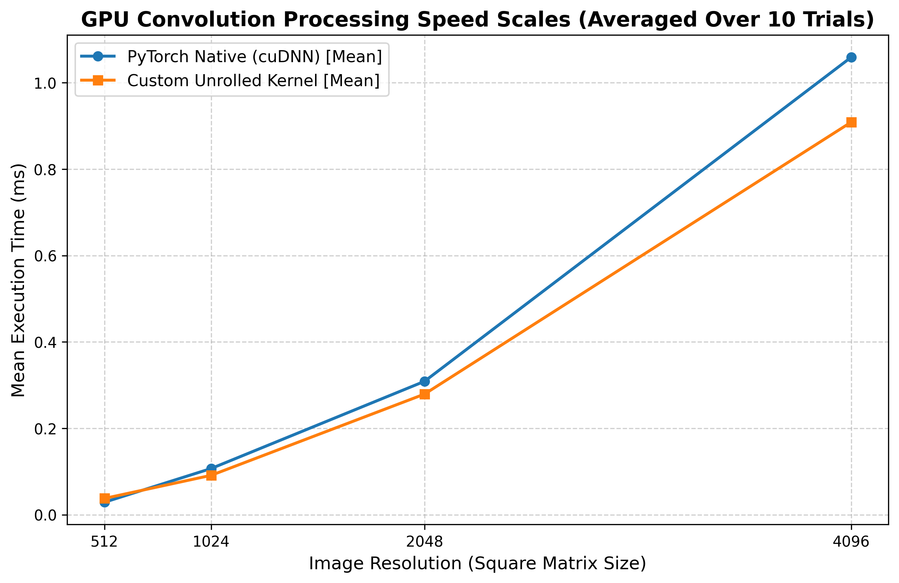

# Hardware-Accelerated 2D CUDA Convolution

A high-performance 2D image convolution acceleration engine engineered from scratch in native CUDA C++. This project demonstrates a complete step-by-step low-level optimization progression, transitioning a foundational deep learning operation into a production-grade GPU kernel that outperforms framework-level baselines at scale.

## Performance Benchmark Matrix

The following execution metrics represent the statistical mean captured over 10 independent profiling trials on an NVIDIA Tesla GPU. Custom tiled, coalesced, and unrolled kernel processing times are compared directly against PyTorch's native production engine (`torch.nn.functional.conv2d` utilizing cuDNN).

| Resolution | PyTorch cuDNN Baseline (Mean) | Custom Optimized Kernel (Mean) | Architectural Status | Correctness Verification |
|------------|-------------------------------|--------------------------------|----------------------|--------------------------|
| 512x512    | 0.0289 ms                     | 0.0376 ms                      | Launch-Overhead Bound| **PASSED** |
| 1024x1024  | 0.1069 ms                     | 0.0911 ms                      | **1.17x Speedup** | **PASSED** |
| 2048x2048  | 0.3087 ms                     | 0.2792 ms                      | **1.11x Speedup** | **PASSED** |
| 4096x4096  | 1.0590 ms                     | 0.9087 ms                      | **1.16x Speedup** | **PASSED** |

*Note: All custom kernel outputs are verified element-wise against native PyTorch tensors to guarantee 100% mathematical accuracy within floating-point tolerance across all tested dimensions.*

---



## Low-Level Optimization Walkthrough

### 1. Naive Implementation (`conv_naive.cu`)
The baseline implementation maps a standard 2D grid of threads to the image canvas. Each thread is independently responsible for loading a $3 \times 3$ pixel window directly from Global VRAM to process its convolution math. While modern L1/L2 hardware caches capture minor spatial locality at small resolutions, this approach introduces severe VRAM bus saturation and redundant global memory fetches at scale.

### 2. Shared Memory Tiling (`conv_tiled.cu`)
To maximize data reuse, this iteration introduces on-chip `__shared__` memory allocations. Threads within a localized $16 \times 16$ block cooperatively load an $18 \times 18$ data tile (including a 1-pixel border "halo" padding) into fast scratchpad memory. This significantly reduces global VRAM requests but introduces a performance penalty due to heavy branch divergence caused by isolated conditional statements (`if/else` checks) used to load individual halo rows and corners.

### 3. Global Memory Coalescing (`conv_coalesced.cu`)
This kernel completely restructures the data-loading pipeline by eliminating divergent conditional code blocks. The $16 \times 16$ thread block is flattened into a one-dimensional, 256-thread pipeline that utilizes a block-stride loop to load the 324-element shared memory tile in a continuous, sequential stride. This forces the GPU's memory controller to execute perfectly coalesced single-burst memory transactions, maximizing memory bandwidth saturation.

### 4. Loop Unrolling & Instruction Parallelism (`conv_unrolled.cu`)
The final optimization phase targets instruction-level overhead within the core math loops. By utilizing the `#pragma unroll` compiler directive, the nested $3 \times 3$ loops are completely flattened into 9 sequential assembly instructions at compile time. This eliminates loop counter arithmetic, removes conditional branch instructions, and maximizes Instruction-Level Parallelism (ILP) within the GPU execution pipelines.

---

## How to Compile & Run

### Prerequisites
* Linux environment or Google Colab
* NVIDIA CUDA Toolkit (`nvcc` compiler)
* PyTorch (with CUDA support)

### 1. Build and Install the Python Module Extension
Compile the native C++ wrapper and CUDA kernels directly into a shared binary module utilizing the PyTorch `setuptools` utility:
```bash
pip install .
```

Google Collab Link:
https://colab.research.google.com/drive/1DZUvhmO7eIotW-mb0qQ-MDWC6Ne2HvF0#scrollTo=s30ZS-v41njw
